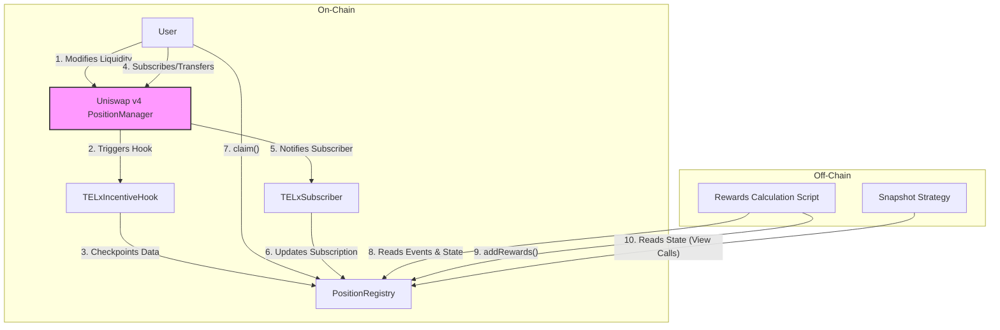

# TELx Uniswap v4 Liquidity System: Security Specification

## 1. Overview

This document provides a technical specification for the TELx Uniswap v4 Liquidity System, intended for security auditors and developers.

The system is a hybrid on-chain/off-chain solution designed to track Uniswap v4 liquidity provider (LP) positions, distribute weighted rewards, and calculate governance voting power. It integrates with Uniswap v4's hook and subscriber mechanisms to capture on-chain data with minimal gas overhead, while leveraging off-chain services for complex, gas-intensive calculations like reward weighting and position valuation.

The primary goal is to create a secure, efficient, and flexible framework for incentivizing long-term liquidity and enabling LP participation in governance.

## 2. System Architecture & Scope

The system comprises on-chain smart contracts and off-chain services that interact with them.

### In-Scope Contracts

The scope of this security audit includes the following Solidity smart contracts:

1.  **`PositionRegistry.sol`**: The core state contract, acting as the single source of truth for all tracked position data, checkpoints, and reward balances.
2.  **`TELxIncentiveHook.sol`**: The Uniswap v4 hook that listens to on-chain liquidity events and forwards data to the `PositionRegistry`.
3.  **`TELxSubscriber.sol`**: The `ISubscriber` implementation that listens for position NFT transfers and updates ownership records in the `PositionRegistry`.

### Off-Chain Components (For Context)

The following off-chain services are critical to the system's function but their code is **out of scope** for this audit. However, their interactions with the in-scope contracts are a key part of the review.

1.  **Rewards Calculation Script**: An off-chain service that reads data from the `PositionRegistry` to calculate weighted rewards. It then calls a privileged function on the `PositionRegistry` to distribute these rewards.
2.  **Custom Snapshot Strategy**: A JavaScript module running on Snapshot's infrastructure that reads position data from the `PositionRegistry` to calculate voting power. It makes **read-only** calls to the on-chain contracts.

### Architectural Flow

## 3. Roles and Access Control

The system uses OpenZeppelin's `AccessControl` to manage privileges.

- **`DEFAULT_ADMIN_ROLE`**
  - **Holder**: A secure multisig or DAO.
  - **Permissions**: Can grant/revoke all other roles. Can initialize new pools for tracking via the `TELxIncentiveHook`.
- **`SUPPORT_ROLE`**
  - **Holder**: An operational multisig or automated address controlled by the rewards script operator.
  - **Permissions**:
    - `PositionRegistry::addRewards()`: Distributes calculated rewards to users.
    - `PositionRegistry::updateRouter()`: Manages the list of trusted routers.
    - `PositionRegistry::erc20Rescue()`: Recovers mis-sent tokens.
- **`UNI_HOOK_ROLE`**
  - **Holder**: The deployed `TELxIncentiveHook` contract address.
  - **Permissions**: `PositionRegistry::addOrUpdatePosition()`. This is the sole entry point for recording liquidity and fee growth data.
- **`SUBSCRIBER_ROLE`**
  - **Holder**: The deployed `TELxSubscriber` contract address.
  - **Permissions**: `PositionRegistry::handleSubscribe()`, `handleUnsubscribe()`, `handleModifyLiquidity()`, `handleBurn()`.

## 4. Trust Assumptions & External Dependencies

1.  **Uniswap v4 Contracts**: The system trusts that the Uniswap v4 `PoolManager` and `PositionManager` contracts are secure and will provide authentic, correct data to the hook and subscriber contracts.
2.  **Off-Chain Services**: The on-chain contracts assume that the operators of the Rewards Script and Snapshot Strategy are trusted. The contracts must be secure even if a compromised `SUPPORT_ROLE` holder sends validly-formatted but incorrect reward data. The attack surface is limited to the rewards held by the `PositionRegistry`.
3.  **NFT Ownership**: The system considers the `PositionManager` the single source of truth for position NFT ownership.
4.  **Governance**: The `DEFAULT_ADMIN_ROLE` is assumed to be held by a secure, trusted entity (e.g., a DAO with a timelock).

## 5. Detailed Component Breakdown

### `PositionRegistry.sol`

- **Purpose**: Acts as the core state machine and database for all LP data.
- **Key State**:
  - `mapping(uint256 => Position) public positions`: Stores core data for each position, including a dynamic array of `FeeGrowthCheckpoint` structs.
  - `mapping(address => uint256[]) public subscriptions`: Tracks which positions a user has actively subscribed to.
  - `mapping(address => uint256) public unclaimedRewards`: Tracks claimable rewards for each user.
- **Key Functions & Intended Behavior**:
  - `addOrUpdatePosition()`: Called exclusively by the hook. Atomically records a position's liquidity change and its `feeGrowthInside` at that block, pushing a new checkpoint to storage.
  - `handleSubscribe()` / `handleUnsubscribe()`: Called exclusively by the subscriber. Manages a user's opt-in status. Unsubscribing occurs on transfer, requiring new owners to re-subscribe.
  - `addRewards()`: Called by `SUPPORT_ROLE`. Accepts a batch of rewards and credits the `unclaimedRewards` mapping. Protected by a `nonReentrant` guard.
  - `claim()`: A user-facing function to withdraw from `unclaimedRewards`. Protected by a `nonReentrant` guard.

### `TELxIncentiveHook.sol`

- **Purpose**: A minimal, gas-efficient data collector that interfaces directly with Uniswap v4.
- **Interaction Points**:
  - `beforeInitialize`: A privileged function for the `DEFAULT_ADMIN_ROLE` to approve new pools for tracking.
  - `beforeModifyPosition`: Captures all liquidity changes (mint, add, remove, collect).
- **Core Logic**: This contract is designed to be stateless. Upon a hook trigger, it reads data provided by the `PoolManager`, performs necessary checks, and immediately calls the `PositionRegistry` to record the data. Its primary security concern is ensuring it accurately relays data without introducing vulnerabilities.

### `TELxSubscriber.sol`

- **Purpose**: Securely forwards ownership change events from the `PositionManager` to the `PositionRegistry`.
- **Security Model**: Its primary security feature is the `onlyPositionManager` modifier, which ensures that all notifications (`notifySubscribe`, `notifyUnsubscribe`, etc.) are authentically from the Uniswap v4 `PositionManager` contract, preventing spoofed ownership changes.

## 6. Off-Chain Logic (Context for On-Chain Interactions)

### Rewards Calculation Script

The off-chain script implements a three-tiered weighting system to incentivize long-term liquidity provision.

- It reads `Checkpoint` event data from the `PositionRegistry` to calculate the `feeGrowth` accrued by each subscribed position during a reward epoch.
- It classifies each position's activity as **JIT**, **Active**, or **Passive** based on its on-chain lifetime, measured in blocks.
- It applies a configurable weight (e.g., 0.25 for JIT, 1.0 for Passive) to the `feeGrowth` to determine a final "weighted score."
- Rewards from the epoch's TEL budget are distributed pro-rata based on these weighted scores.
- The script's final action is to call the privileged `PositionRegistry.addRewards()` function.

### Snapshot Voting Strategy

The voting strategy runs entirely off-chain on Snapshot's infrastructure and makes **read-only** calls to the `PositionRegistry`.

1.  It fetches a voter's subscribed position IDs and their corresponding raw data (liquidity, ticks, pool currencies).
2.  It calls a trusted external price oracle (e.g., CoinGecko API) to get historical USD prices for all tokens at the proposal's snapshot block.
3.  It calculates the total USD value of the LP position.
4.  It converts this USD value into a final TEL-denominated voting power.

## 7. Known Risks & Mitigations

- **Off-Chain Service Compromise**:
  - **Risk**: A compromised `SUPPORT_ROLE` key could allow an attacker to call `addRewards()` with false data, unfairly distributing the reward pool.
  - **Mitigation**: The `SUPPORT_ROLE` should be a secure multisig. The contract cannot be drained of more TEL than has been deposited for rewards. The core position data remains unaffected.
- **JIT Lifetime Gaming**:
  - **Risk**: A sophisticated actor could create zero-liquidity positions and let them "age" on-chain. They could then add liquidity for a single block (JIT) in an attempt to receive the higher "Passive" reward weight.
  - **Mitigation**: This requires maintaining a gamut of positions in dormant state to cover a wide variety of tick ranges which are not guaranteed to be relevant to the current price and ongoing swaps at any given time. It requires a substantial degree of serendepitiy as well as significant technical sophistication and ongoing maintenance costs which are unlikely to be worth the potential reward payout of higher weighted fee growth and thus is considered an accepted risk.
