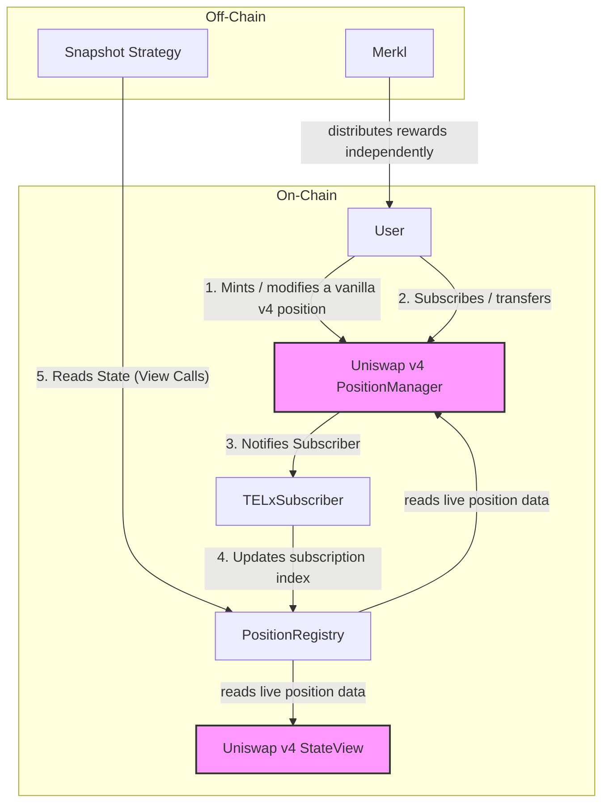

# TELx Uniswap v4 Liquidity System: Security Specification

## 1. Overview

This document provides a technical specification for the TELx Uniswap v4 Liquidity System, intended for security auditors and developers.

The system is a lightweight on-chain index that tracks which Uniswap v4 liquidity provider (LP) positions have opted into the TELx program, so that off-chain services can calculate governance voting power. TELx pools are vanilla Uniswap v4 pools with no custom hook; our contracts hold no liquidity, no reward balances, and no pricing logic.

Reward distribution is handled off-chain by Merkl and is out of scope for this specification. The on-chain contracts do not perform any reward math, weighting, accrual, or claims.

The primary goal is to provide a secure, minimal, and accurate on-chain source of truth for "which positions are subscribed" that the Snapshot voting strategy can read.

## 2. System Architecture & Scope

The system comprises two on-chain smart contracts plus one off-chain read-only service.

### In-Scope Contracts

The scope of this security audit includes the following Solidity smart contracts:

1.  **`PositionRegistry.sol`**: A thin subscription index plus a live view layer over Uniswap's own `PositionManager` and `StateView`. It records which position NFTs have opted into TELx and exposes view shims that read live position data from Uniswap. It stores no liquidity, fee-growth checkpoints, reward balances, or weights.
2.  **`TELxSubscriber.sol`**: The `ISubscriber` implementation that relays position subscribe/unsubscribe/burn/modify-liquidity notifications from the Uniswap v4 `PositionManager` into the `PositionRegistry`.

TELx pools are plain Uniswap v4 pools. There is no custom hook, no `beforeInitialize`, no `afterAddLiquidity`/`afterRemoveLiquidity`, and no on-chain pool registration.

#### Deployment Addresses

The post-migration (hook removal) contracts are not yet deployed. The addresses below are placeholders to be filled in after the migration deploy.

**Base Mainnet**
PositionRegistry: to be redeployed (post-migration)
TELxSubscriber: to be redeployed (post-migration)
Supported Pools:
"BASE_ETH_TEL": 0x727b2741ac2b2df8bc9185e1de972661519fc07b156057eeed9b07c50e08829b

**Polygon Mainnet**
PositionRegistry: to be redeployed (post-migration)
TELxSubscriber: to be redeployed (post-migration)
Supported Pools:
"POLYGON_WETH_TEL": 0x25412ca33f9a2069f0520708da3f70a7843374dd46dc1c7e62f6d5002f5f9fa7
"POLYGON_USDC_EMXN": 0x37dafec81119c7987538ac000b8a8a16a7f4daeecf91626efc9956ccd5146246

#### Verification

The registry constructor is `constructor(address positionManager, address stateView, address admin)`. The subscriber constructor is `constructor(address registry, address positionManager, address owner)`.

```bash
forge verify-contract registry contracts/telx/core/PositionRegistry.sol:PositionRegistry --constructor-args $(cast abi-encode "constructor(address,address,address)" positionmanager stateview admin) --rpc-url $RPC_URL --etherscan-api-key $ETHERSCAN_API_KEY --watch

forge verify-contract subscriber contracts/telx/core/TELxSubscriber.sol:TELxSubscriber --constructor-args $(cast abi-encode "constructor(address,address,address)" registry positionmanager owner) --rpc-url $RPC_URL --etherscan-api-key $ETHERSCAN_API_KEY --watch
```

### Off-Chain Components (For Context)

The following off-chain logic is critical to the system's function but its code is **out of scope** for this audit. Its interactions with the in-scope contracts are still a relevant part of the review.

1.  **Custom Snapshot Strategy**: A JavaScript module running on Snapshot's infrastructure that reads position data from the `PositionRegistry` to calculate voting power. It makes **read-only** calls to the on-chain contracts.
2.  **Merkl Reward Distribution**: Reward calculation and distribution is handled entirely by Merkl, off-chain. Our contracts do not touch reward math, accrual, or claims, and Merkl does not call any privileged function on our contracts.

### Architectural Flow


```mermaid
graph TD
    subgraph On-Chain
        User -- 1. Mints / modifies a vanilla v4 position --> UNISWAP_V4[Uniswap v4 PositionManager];
        User -- 2. Subscribes / transfers --> UNISWAP_V4;
        UNISWAP_V4 -- 3. Notifies Subscriber --> Subscriber[TELxSubscriber];
        Subscriber -- 4. Updates subscription index --> Registry[PositionRegistry];
        Registry -- reads live position data --> UNISWAP_V4;
        Registry -- reads live position data --> STATEVIEW[Uniswap v4 StateView];
    end

    subgraph Off-Chain
        Snapshot[Snapshot Strategy] -- 5. Reads State (View Calls) --> Registry;
        Merkl[Merkl] -- distributes rewards independently --> User;
    end

    style UNISWAP_V4 fill:#f9f,stroke:#333,stroke-width:2px
    style STATEVIEW fill:#f9f,stroke:#333,stroke-width:2px
```

## 3. Roles and Access Control

The system uses OpenZeppelin's `AccessControl` to manage privileges on the `PositionRegistry`.

- **`DEFAULT_ADMIN_ROLE`**
  - **Holder**: A secure multisig or DAO.
  - **Permissions**: Can grant and revoke all other roles.
- **`SUBSCRIBER_ROLE`**
  - **Holder**: The deployed `TELxSubscriber` contract address.
  - **Permissions**: `PositionRegistry::handleSubscribe()`, `handleUnsubscribe()`, and `handleBurn()`. This is the sole entry point for mutating the subscription index.
- **`SUPPORT_ROLE`**
  - **Holder**: An operational multisig.
  - **Permissions**: `PositionRegistry::erc20Rescue()` only - recovers mis-sent ERC-20 tokens.

`pruneSubscription(uint256)` is **permissionless**: anyone may call it to clean up a stale subscription entry whose underlying position no longer qualifies.

There is no `UNI_HOOK_ROLE` - the hook has been removed. `TELxSubscriber` is `Ownable2Step`; its owner can re-point the registry via `setRegistry(IPositionRegistry)`.

## 4. Trust Assumptions & External Dependencies

1.  **Uniswap v4 Contracts**: The system trusts that the Uniswap v4 `PositionManager` and `StateView` contracts are secure and provide authentic, correct position data. The registry's view shims read directly from these contracts.
2.  **NFT Ownership**: The system considers the `PositionManager` the single source of truth for position NFT ownership.
3.  **Off-Chain Services**: The Snapshot strategy is read-only; a compromise of it cannot affect on-chain state. Reward distribution via Merkl is independent of these contracts.
4.  **Governance**: The `DEFAULT_ADMIN_ROLE` is assumed to be held by a secure, trusted entity (e.g., a DAO with a timelock).

## 5. Detailed Component Breakdown

### `PositionRegistry.sol`

- **Purpose**: A thin subscription index plus a live view layer over Uniswap v4. It records which position NFTs have opted into TELx and exposes views that read live position data from Uniswap's own contracts.
- **Key State**:
  - `mapping(uint256 => bool) subscriptions` (exposed via `subscriptions`/`isSubscribed`): tracks whether a given position NFT is currently subscribed.
  - Per-pool and per-owner subscription lists, used by `getSubscriptions`/`getSubscribed`.
- **It does not store**: liquidity, fee-growth checkpoints, reward balances, JIT/Active/Passive weights, a trusted-router registry, or a pool registry. All of that machinery was removed with the hook.
- **Caps**:
  - `MAX_SUBSCRIBED = 50_000` - per-pool subscription cap (unchanged).
  - `MAX_SUBSCRIPTIONS = 1_000` - per-LP subscription cap. This was raised from 100: the old cap was a gas-safety bound on on-chain iteration over the per-owner array, and no such iteration remains.
- **Key Functions & Intended Behavior**:
  - `handleSubscribe()` / `handleUnsubscribe()` / `handleBurn()`: Called exclusively by the subscriber (`SUBSCRIBER_ROLE`). Manage a position's opt-in status. Unsubscribing occurs on transfer or burn, requiring new owners to re-subscribe.
  - `pruneSubscription(uint256)`: Permissionless cleanup. Removes a stale subscription entry for a position that has been transferred or burned, or is no longer `subscriptionEligible`.
  - `subscriptionEligible(uint256)`: View returning whether a position meets the liquidity threshold and, when `inRangeRequired` is enabled, is in range. The single source of truth for eligibility.
  - `belowSubscriptionThreshold(uint256)` / `isInRange(uint256)`: Component views for the liquidity-threshold and in-range checks respectively.
  - `getPosition`, `getPositionDetails`, `getLiquidityLast`, `validPool`: **Live view shims** that read from the Uniswap v4 `PositionManager` and `StateView` rather than internal storage.
  - `getSubscriptions(owner)`: Returns only currently-votable positions (still owned by `owner` and `subscriptionEligible`); the Snapshot strategy consumes this directly. `getSubscriptionsRaw(owner)` returns the full unfiltered stored set for ops and prune bots.
  - `getSubscribed`, `getAmountsForLiquidity`, `isTokenSubscribed`, `isSubscribed`, `inRangeRequired`: Views over the subscription index, configuration, and derived data.
  - `setInRangeRequired(bool)`: Called by `DEFAULT_ADMIN_ROLE`. Toggles the in-range requirement.
  - `erc20Rescue()`: Called by `SUPPORT_ROLE`. Recovers mis-sent ERC-20 tokens.

### `TELxSubscriber.sol`

- **Purpose**: Securely forwards position lifecycle events from the Uniswap v4 `PositionManager` to the `PositionRegistry`.
- **Security Model**: Its primary security feature is the `onlyPositionManager` modifier, which ensures all notifications (`notifySubscribe`, `notifyUnsubscribe`, `notifyBurn`, `notifyModifyLiquidity`) are authentically from the Uniswap v4 `PositionManager`, preventing spoofed events.
- **`notifyModifyLiquidity`**: No longer a no-op. It enforces subscription eligibility: if a subscribed position's live liquidity falls below the threshold, or the position is no longer in range, it is unsubscribed.
- **Configurability**: The contract is `Ownable2Step`. Its `registry` pointer is owner-swappable via `setRegistry(IPositionRegistry)`.

## 6. Subscription Eligibility

A position is `subscriptionEligible` only if it satisfies **both** conditions below:

- **Liquidity threshold:** its liquidity is at least 1 basis point (0.01%) of the pool's total liquidity - that is, `liquidity >= totalLiquidity / 10_000`. As an exception, if the pool's total liquidity is less than or equal to 10,000, any non-zero position liquidity qualifies.
- **In range:** when the `inRangeRequired` flag is enabled, the pool's current tick must sit within the position's `[tickLower, tickUpper)` range. An out-of-range position provides no live liquidity and earns no voting power. The flag defaults to enabled and the admin can toggle it via `setInRangeRequired`.

`handleSubscribe` enforces eligibility at subscribe time; `notifyModifyLiquidity` re-checks it on liquidity modification, and `pruneSubscription` lets anyone remove a position that has become ineligible. `getSubscriptions(owner)` evaluates eligibility live and returns only currently-votable positions, so a pinned-block read by the Snapshot strategy needs no filter of its own.

## 7. Off-Chain Logic (Context for On-Chain Interactions)

### Reward Distribution (Merkl)

Reward distribution is handled entirely off-chain by Merkl. The TELx contracts in this directory perform no reward math, no weighting, no accrual, and no claims. LPs claim rewards directly on Merkl. This logic is out of scope for this specification.

### Snapshot Voting Strategy

The voting strategy runs entirely off-chain on Snapshot's infrastructure and makes **read-only** calls to the `PositionRegistry`. The `uni-v4-telx-lp` strategy is unchanged by the hook removal.

1.  It fetches a voter's subscribed position IDs via `getSubscriptions` and their corresponding raw data via `getPositionDetails` (liquidity, ticks, pool currencies).
2.  It uses `getAmountsForLiquidity` to convert raw liquidity and tick data into token amounts.
3.  It calls a trusted external price oracle (e.g., CoinGecko API) to get historical USD prices for all tokens at the proposal's snapshot block.
4.  It calculates the total USD value of the LP position and converts it into a final TEL-denominated voting power.

## 8. Known Risks & Mitigations

- **Stale subscription entries**:
  - **Risk**: A subscribed position may drop below the liquidity threshold or drift out of range (the latter on price movement, with no on-chain callback) without an event that prunes its index entry.
  - **Mitigation**: `notifyModifyLiquidity` unsubscribes positions that have become ineligible on their next liquidity event, and the permissionless `pruneSubscription` lets anyone clean up stale entries at any time. `getSubscriptions` also evaluates eligibility live, so a stale stored entry is excluded from the votable set the moment it becomes ineligible and does not by itself confer voting power.
- **Misconfigured Uniswap addresses**:
  - **Risk**: If the registry is constructed with an incorrect `PositionManager` or `StateView`, its view shims would return wrong data.
  - **Mitigation**: Constructor arguments are verified at deploy time and against production state by the Polygon fork tests.
