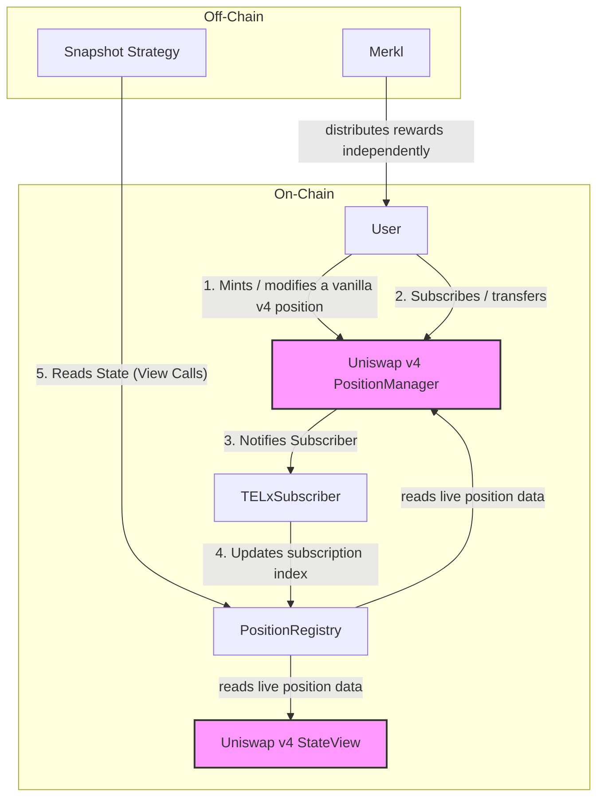

# TELx Uniswap v4 Liquidity System: Security Specification

## 1. Overview

This document provides a technical specification for the TELx Uniswap v4 Liquidity System, intended for security auditors and developers.

The system is a lightweight on-chain index that tracks which Uniswap v4 liquidity provider (LP) positions have opted into the TELx program, so that off-chain services can calculate governance voting power. TELx pools are vanilla Uniswap v4 pools with no custom hook; our contracts hold no liquidity, no reward balances, and no pricing logic.

Reward distribution is handled off-chain by Merkl and is out of scope for this specification. The on-chain contracts do not perform any reward math, weighting, accrual, or claims.

The primary goal is to provide a secure, minimal, and accurate on-chain source of truth for "which positions are subscribed" that the Snapshot voting strategy can read.

## 2. System Architecture & Scope

The system comprises two on-chain smart contracts plus one off-chain read-only service.

### In-Scope Contracts

The scope of this security audit includes the following Solidity smart contracts:

1.  **`PositionRegistry.sol`**: A thin subscription index plus a live view layer over Uniswap's own `PositionManager` and `StateView`. It records which position NFTs have opted into TELx and exposes view shims that read live position data from Uniswap. It stores no liquidity, fee-growth checkpoints, reward balances, or weights.
2.  **`TELxSubscriber.sol`**: The `ISubscriber` implementation that relays position subscribe/unsubscribe/burn/modify-liquidity notifications from the Uniswap v4 `PositionManager` into the `PositionRegistry`.

TELx pools are plain Uniswap v4 pools. There is no custom hook, no `beforeInitialize` and no `afterAddLiquidity`/`afterRemoveLiquidity`. The registry keeps an admin-managed allowlist of the pools whose positions may subscribe, populated in the same Safe batch that deploys it; a pool that is not on the list is invisible to the index, whatever its liquidity.

#### Deployment Addresses

The post-migration (hook removal) contracts are not yet deployed. They are deployed by
`script/telx/DeployTELxRegistry.s.sol` through the governance Safe, using CreateX CREATE3 in
cross-chain mode, so both land at the same address on every chain regardless of the per-chain
constructor arguments. See `script/telx/README.md` for the runbook.

**Predicted addresses (Ethereum, Polygon and Base)**

| Contract | Address |
| --- | --- |
| PositionRegistry | `0x00637FBbae593E920B1d08300EC1f05d6D61Aa61` |
| TELxSubscriber | `0xD9e2c4A560ba8FD0f28A5Bf25B3940576cc53fEC` |

Derived from the deployer Safe `0x6012dBcb4350Ab297FeB7f96D4d86258062aeB03` and the salts in
`script/shared/Salts.sol`; verified against the live CreateX factory on all three chains and
confirmed unoccupied as of 2026-09-11. `DeployTELxRegistrySaltTest` pins them. Replace this heading
with the confirmed addresses once the Safe batches execute.

**Legacy TEL v2 deployments (still live, unaffected by this migration)**

| Chain | PositionRegistry | TELxSubscriber |
| --- | --- | --- |
| Polygon | `0x2c33fC9c09CfAC5431e754b8fe708B1dA3F5B954` | `0x3Bf9bAdC67573e7b4756547A2dC0C77368A2062b` |
| Base | `0x3994e3ae3Cf62bD2a3a83dcE73636E954852BB04` | `0x735ee950D979C70C14FAa739f80fC96d9893f7ED` |

These index TEL v2 pools and keep working; they are simply not where TEL v3 liquidity is tracked. Each legacy pool carries its own TELxIncentiveHook instance.

| Legacy pool | Pool id | TELxIncentiveHook |
| --- | --- | --- |
| Base ETH/TEL v2 | `0x727b2741ac2b2df8bc9185e1de972661519fc07b156057eeed9b07c50e08829b` | `0x23aB2e6D4Ab0c5f872567098671F1ffb46Fd2500` |
| Polygon WETH/TEL v2 | `0x25412ca33f9a2069f0520708da3f70a7843374dd46dc1c7e62f6d5002f5f9fa7` | `0xD77cC9230Ded5b6591730032975453744532a500` |
| Polygon USDC/eMXN | `0x37dafec81119c7987538ac000b8a8a16a7f4daeecf91626efc9956ccd5146246` | `0x13B979ecB3280bFf58A94B50ac6250f7Ca52a500` |

**TEL v3 pool ids**

Recorded here as each pool is created. The seven-pool set and the script that creates them are in
`script/telx/README.md`.

| Pool | Pool id |
| --- | --- |
| `ETHEREUM_ETH_TEL` | not yet created |
| `ETHEREUM_EUSD_TEL` | not yet created |
| `POLYGON_WETH_TEL` | not yet created |
| `POLYGON_EUSD_TEL` | not yet created |
| `POLYGON_EUSD_EMXN` | not yet created |
| `BASE_ETH_TEL` | not yet created |
| `BASE_EUSD_TEL` | not yet created |

#### Verification

The registry constructor is `constructor(address positionManager, address stateView, address admin)`. The subscriber constructor is `constructor(address registry, address positionManager, address owner)`.

```bash
forge verify-contract registry contracts/telx/core/PositionRegistry.sol:PositionRegistry --constructor-args $(cast abi-encode "constructor(address,address,address)" positionmanager stateview admin) --rpc-url $RPC_URL --etherscan-api-key $ETHERSCAN_API_KEY --watch

forge verify-contract subscriber contracts/telx/core/TELxSubscriber.sol:TELxSubscriber --constructor-args $(cast abi-encode "constructor(address,address,address)" registry positionmanager owner) --rpc-url $RPC_URL --etherscan-api-key $ETHERSCAN_API_KEY --watch
```

### Off-Chain Components (For Context)

The following off-chain logic is critical to the system's function but its code is **out of scope** for this audit. Its interactions with the in-scope contracts are still a relevant part of the review.

1.  **Custom Snapshot Strategy**: A JavaScript module running on Snapshot's infrastructure that reads position data from the `PositionRegistry` to calculate voting power. It makes **read-only** calls to the on-chain contracts.
2.  **Merkl Reward Distribution**: Reward calculation and distribution is handled entirely by Merkl, off-chain. Our contracts do not touch reward math, accrual, or claims, and Merkl does not call any privileged function on our contracts.

### Architectural Flow


```mermaid
graph TD
    subgraph On-Chain
        User -- 1. Mints / modifies a vanilla v4 position --> UNISWAP_V4[Uniswap v4 PositionManager];
        User -- 2. Subscribes / transfers --> UNISWAP_V4;
        UNISWAP_V4 -- 3. Notifies Subscriber --> Subscriber[TELxSubscriber];
        Subscriber -- 4. Updates subscription index --> Registry[PositionRegistry];
        Registry -- reads live position data --> UNISWAP_V4;
        Registry -- reads live position data --> STATEVIEW[Uniswap v4 StateView];
    end

    subgraph Off-Chain
        Snapshot[Snapshot Strategy] -- 5. Reads State (View Calls) --> Registry;
        Merkl[Merkl] -- distributes rewards independently --> User;
    end

    style UNISWAP_V4 fill:#f9f,stroke:#333,stroke-width:2px
    style STATEVIEW fill:#f9f,stroke:#333,stroke-width:2px
```

## 3. Roles and Access Control

The system uses OpenZeppelin's `AccessControl` to manage privileges on the `PositionRegistry`.

- **`DEFAULT_ADMIN_ROLE`**
  - **Holder**: The governance Safe.
  - **Permissions**: Grants and revokes the other two roles. Manages the pool allowlist (`registerPool`, `deregisterPool`), the per-pool absolute liquidity floor (`setMinLiquidity`), the in-range gate (`setInRangeRequired`), and holds the eviction backstop (`forceUnsubscribe`, `forceUnsubscribeBatch`). The role itself follows OpenZeppelin's `AccessControlDefaultAdminRules`: one holder, moved only through a two-step transfer with a 3 day delay, never granted to a second address or renounced in one call.
- **`SUBSCRIBER_ROLE`**
  - **Holder**: The deployed `TELxSubscriber` contract address.
  - **Permissions**: `PositionRegistry::handleSubscribe()`, `handleUnsubscribe()`, and `handleBurn()`. This is the sole entry point for mutating the subscription index.
- **`SUPPORT_ROLE`**
  - **Holder**: An operational multisig.
  - **Permissions**: `PositionRegistry::erc20Rescue()` only - recovers mis-sent ERC-20 tokens.

`pruneSubscription(uint256)` is **permissionless**: anyone may call it to remove a stale entry whose position has been transferred, burned, or drained to zero liquidity. It decides on those position-local facts only; it never consults the pool's liquidity or tick, and it refuses to run while the `PoolManager` is unlocked. `resubscribe(uint256)` is its permissionless counterpart: it re-indexes a position that Uniswap still reports subscribed to the TELx subscriber but that the index no longer holds (a drained position pruned and later refilled), under the same checks as a fresh subscribe.

There is no `UNI_HOOK_ROLE` - the hook has been removed. `TELxSubscriber` is `Ownable2Step` and owned by the governance Safe; the owner can re-point the registry via `setRegistry(IPositionRegistry)`, which only accepts a deployed registry that has already granted the subscriber `SUBSCRIBER_ROLE`. `renounceOwnership` reverts.

## 4. Trust Assumptions & External Dependencies

1.  **Uniswap v4 Contracts**: The system trusts that the Uniswap v4 `PositionManager` and `StateView` contracts are secure and provide authentic, correct position data. The registry's view shims read directly from these contracts.
2.  **NFT Ownership**: The system considers the `PositionManager` the single source of truth for position NFT ownership.
3.  **Off-Chain Services**: The Snapshot strategy is read-only; a compromise of it cannot affect on-chain state. Reward distribution via Merkl is independent of these contracts.
4.  **Governance**: The `DEFAULT_ADMIN_ROLE` is assumed to be held by a secure, trusted entity (e.g., a DAO with a timelock).

## 5. Detailed Component Breakdown

### `PositionRegistry.sol`

- **Purpose**: A thin subscription index plus a live view layer over Uniswap v4. It records which position NFTs have opted into TELx and exposes views that read live position data from Uniswap's own contracts.
- **Key State**:
  - `isTokenSubscribed[tokenId]` and the per-owner `subscriptions[owner]` list, with swap-and-pop indices so subscribe and unsubscribe are O(1).
  - `subscriptionOwner[tokenId]`: the owner at subscribe time, which `pruneSubscription` compares against the live owner.
  - `subscribed`: the list of distinct owners with at least one subscription, bounded by `MAX_SUBSCRIBED`.
  - `poolAllowed[poolId]` and `minLiquidity[poolId]`: the admin allowlist and the absolute liquidity floor per pool. Every allowlisted pool carries a non-zero floor, set in the deploy batch; it is sized so that the narrowest in-range position is worth a governance-chosen amount of currency1, which is what makes a cap slot cost capital rather than gas.
  - `inRangeRequired`: the in-range gate, enabled by default.
- **It does not store**: liquidity, fee-growth checkpoints, reward balances, JIT/Active/Passive weights, or a trusted-router registry. Every fact about a position is read live from Uniswap.
- **Caps**:
  - `MAX_SUBSCRIBED = 50_000` - global cap on distinct subscribed owners across all pools, checked on an owner's first subscription. The allowlist restricts slots to real TELx pools and the per-pool floor makes each one cost capital that stays locked while the slot is held (a drained position is prunable by anyone).
  - `MAX_SUBSCRIPTIONS = 1_000` - per-LP subscription cap. It bounds the `getSubscriptions` view, which is the only path that iterates the per-owner array.
- **Key Functions & Intended Behavior**:
  - `handleSubscribe()` / `handleUnsubscribe()` / `handleBurn()`: Called exclusively by the subscriber (`SUBSCRIBER_ROLE`). `handleSubscribe` requires an allowlisted, initialized pool, non-zero liquidity at or above the pool's `minLiquidity`, in range when the gate is on, and a locked `PoolManager`; a tokenId already in the index is a no-op. Unsubscribing occurs on transfer or burn, requiring new owners to re-subscribe. `handleUnsubscribe` and `handleBurn` are no-ops for unknown tokenIds and never revert on a stray notification.
  - `pruneSubscription(uint256)`: Permissionless cleanup. Removes an entry whose position has been transferred, burned, or has zero liquidity. Refuses to run while the `PoolManager` is unlocked.
  - `resubscribe(uint256)`: Permissionless repair. Re-indexes a position that the `PositionManager` reports subscribed to a `SUBSCRIBER_ROLE` holder but that the index does not hold, under the same eligibility checks as `handleSubscribe`. Reverts `NotSubscribedOnUniswap` otherwise, so nothing can be indexed that v4 has not opted in.
  - `subscriptionEligible(uint256)`: View returning whether a position sits in an allowlisted pool, meets the pool's liquidity floor and, when `inRangeRequired` is enabled, is in range. The single source of truth for eligibility.
  - `belowSubscriptionThreshold(uint256)` / `isInRange(uint256)`: Component views for the liquidity-floor and in-range checks respectively.
  - `getPosition`, `getPositionDetails`, `getLiquidityLast`, `validPool`: **Live view shims** that read from the Uniswap v4 `PositionManager` and `StateView` rather than internal storage. `validPool` is true only for an allowlisted pool that is initialized on chain.
  - `getSubscriptions(owner)`: Returns only currently-votable positions (still owned by `owner` and `subscriptionEligible`); the Snapshot strategy consumes this directly. `getSubscriptions(owner, offset, limit)` is the paginated form for callers that batch many voters into one `eth_call`. `getSubscriptionsRaw(owner)` returns the full unfiltered stored set for ops and prune bots. All three are for off-chain `eth_call` only and are never consumed on chain.
  - `getSubscribed()`, `getSubscribed(offset, limit)`, `getAmountsForLiquidity`, `isTokenSubscribed`, `isSubscribed`, `poolAllowed`, `minLiquidity`, `inRangeRequired`: Views over the subscription index, configuration, and derived data. `getAmountsForLiquidity` returns exactly what Uniswap's reference `LiquidityAmounts` returns, computed from core `SqrtPriceMath`.
  - `registerPool(PoolKey)` / `deregisterPool(PoolId)` / `setMinLiquidity(PoolId, uint128)` / `setInRangeRequired(bool)`: Called by `DEFAULT_ADMIN_ROLE`. Manage the allowlist, the per-pool floor and the in-range gate.
  - `forceUnsubscribe(uint256)` / `forceUnsubscribeBatch(uint256[])`: Called by `DEFAULT_ADMIN_ROLE`. Evicts entries regardless of state; the batch form clears a filled cap in one transaction.
  - `erc20Rescue()`: Called by `SUPPORT_ROLE`. Recovers mis-sent ERC-20 tokens.

### `TELxSubscriber.sol`

- **Purpose**: Securely forwards position lifecycle events from the Uniswap v4 `PositionManager` to the `PositionRegistry`.
- **Security Model**: Its primary security feature is the `onlyPositionManager` modifier, which ensures all notifications (`notifySubscribe`, `notifyUnsubscribe`, `notifyBurn`, `notifyModifyLiquidity`) are authentically from the Uniswap v4 `PositionManager`, preventing spoofed events.
- **`notifyModifyLiquidity`**: A no-op with no external call. It runs inside the LP's own `unlock`, where any pool-state read is one the transaction controls, so the subscriber does nothing there and cannot affect an increase, decrease or collect under any registry configuration.
- **`notifyBurn`**: Wrapped in try/catch, emitting `NotificationDropped` on failure, so a misconfigured registry can never block a burn. `notifySubscribe` is deliberately not wrapped: a subscribe the registry rejects fails the LP's opt-in loudly, so Uniswap and the registry never disagree about a fresh subscription.
- **Configurability**: The contract is `Ownable2Step`, owned by the governance Safe. `setRegistry(IPositionRegistry)` accepts only a deployed registry that has granted this subscriber `SUBSCRIBER_ROLE`, and the constructor refuses a codeless registry for the same reason the burn wrapper needs one. `renounceOwnership` reverts.

## 6. Subscription Eligibility

A position is `subscriptionEligible` only if it satisfies **all** of the conditions below:

- **Allowlisted pool:** its pool is on the admin allowlist. A pool that is deregistered takes its positions out of the votable set without touching storage.
- **Liquidity floor:** its liquidity is non-zero and at least the pool's admin-set absolute `minLiquidity`. Every allowlisted pool carries one; it is derived at deploy time so that the narrowest in-range position (one tick spacing wide) is worth `minPositionValue1` of currency1 at the opening price, and wider positions need proportionally more (about 33x for a +/-10% band, 670x for the full range at spacing 60). There is no threshold relative to the pool's total liquidity: such a gate can be moved by anyone inside a single `unlock`, and the Snapshot strategy already values positions in USD, so dust votes as dust. The floor's purpose is the cap, not vote weight.
- **In range:** when the `inRangeRequired` flag is enabled, the pool's current tick must sit within the position's `[tickLower, tickUpper)` range. An out-of-range position provides no live liquidity and earns no voting power. The flag defaults to enabled and the admin can toggle it via `setInRangeRequired`.

`handleSubscribe` enforces eligibility at subscribe time; `getSubscriptions(owner)` evaluates it live and returns only currently-votable positions, so a pinned-block read by the Snapshot strategy needs no filter of its own. Nothing enforces eligibility by removal: `pruneSubscription` removes only positions that have been transferred, burned or drained, all of which are facts only the position's owner can change. A position that is merely ineligible keeps its slot and simply does not vote until it qualifies again.

The design rule behind this is that every state-changing path decides only on facts a third party cannot move. The pool's aggregate liquidity and its current tick are never inputs to a write, because both can be set to anything inside one `PoolManager.unlock` for the cost of gas. `handleSubscribe` and `pruneSubscription` additionally refuse to run while the `PoolManager` is unlocked, mirroring `PositionManager.onlyIfPoolManagerLocked`.

## 7. Off-Chain Logic (Context for On-Chain Interactions)

### Reward Distribution (Merkl)

Reward distribution is handled entirely off-chain by Merkl. The TELx contracts in this directory perform no reward math, no weighting, no accrual, and no claims. LPs claim rewards directly on Merkl. This logic is out of scope for this specification.

### Snapshot Voting Strategy

The voting strategy runs entirely off-chain on Snapshot's infrastructure and makes **read-only** calls to the `PositionRegistry`. The `uni-v4-telx-lp` strategy is unchanged by the hook removal.

1.  It fetches a voter's subscribed position IDs via `getSubscriptions` and their corresponding raw data via `getPositionDetails` (liquidity, ticks, pool currencies).
2.  It uses `getAmountsForLiquidity` to convert raw liquidity and tick data into token amounts.
3.  It calls a trusted external price oracle (e.g., CoinGecko API) to get historical USD prices for all tokens at the proposal's snapshot block.
4.  It calculates the total USD value of the LP position and converts it into a final TEL-denominated voting power.

## 8. Known Risks & Mitigations

- **Stale subscription entries**:
  - **Risk**: A subscribed position may be drained, drift out of range, or fall below a pool's floor without an event that prunes its index entry.
  - **Mitigation**: `getSubscriptions` evaluates eligibility live, so a stale stored entry is excluded from the votable set the moment it becomes ineligible and does not by itself confer voting power. The permissionless `pruneSubscription` lets anyone reclaim the slot of a transferred, burned or drained position, and `forceUnsubscribe` gives the admin a backstop for anything else.
- **Flash manipulation of pool state**:
  - **Risk**: Inside a single `PoolManager.unlock`, a caller can set a pool's active liquidity and current tick to arbitrary values for the cost of gas. Any registry write that read those values could be driven to unsubscribe every voter in a pool one block before a Snapshot.
  - **Mitigation**: No registry write reads pool liquidity or tick. `pruneSubscription` decides on ownership and the position's own liquidity only, and both it and `handleSubscribe` revert while the `PoolManager` is unlocked. `test_pruneSubscription_refusedInsideUnlock` exercises this against the live `PoolManager` on Polygon and Base.
- **Cap-fill denial of service**:
  - **Risk**: `MAX_SUBSCRIBED` is a global cap on distinct owners; if gas-only positions could subscribe, an attacker could fill it and block every real LP. The allowlist alone does not prevent that: a full-range position of liquidity 1 in a real pool costs one wei of each token.
  - **Mitigation**: Every allowlisted pool carries a non-zero liquidity floor sized to the narrowest in-range position, so each slot held at once locks at least that much capital, and a drained position is prunable by anyone so the capital cannot be recycled. `forceUnsubscribeBatch` clears a fill in one transaction. The floor relies on the in-range gate staying on.
- **A pruned position that comes back**:
  - **Risk**: A position drained to zero is prunable; if the owner refills it, Uniswap still holds the subscription and refuses a second `subscribe`, so the position would vote nowhere.
  - **Mitigation**: `resubscribe` lets anyone re-index it under the same checks as a fresh subscribe, and a stale record under a previous owner is moved rather than ignored when the new owner subscribes.
- **Registry misconfiguration bricking LP operations**:
  - **Risk**: Uniswap bubbles a revert from `notifyBurn` into the LP's transaction, and a repointed or broken registry could make burns fail.
  - **Mitigation**: `notifyBurn` is wrapped in try/catch and `notifyModifyLiquidity` makes no external call, so no registry state can block an LP's modify or burn. `setRegistry` refuses a target that is not deployed or has not granted the subscriber its role, and `unsubscribe` is the one path Uniswap itself swallows, so an LP can always leave.
- **Misconfigured Uniswap addresses**:
  - **Risk**: If the registry is constructed with an incorrect `PositionManager` or `StateView`, its view shims would return wrong data.
  - **Mitigation**: Constructor arguments are verified at deploy time and against production state by the Polygon fork tests.
